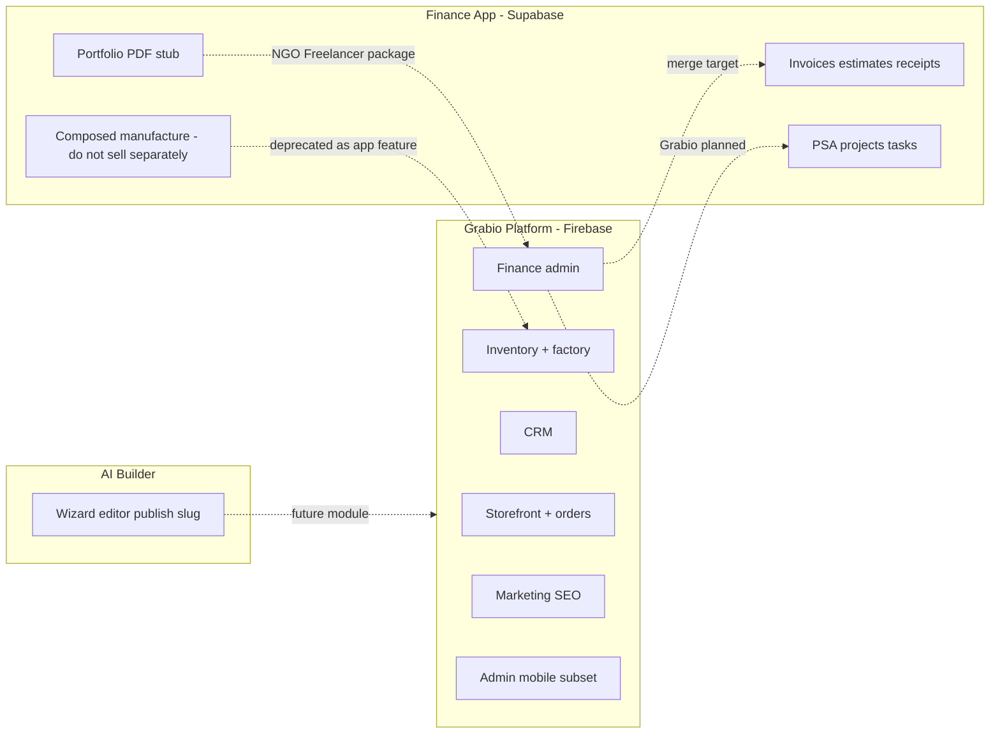

# Grabio Ecosystem — Feature Inventory Study (Code-Based)

**Purpose:** Count **real, billable features** across the three codebases so you can price **features one-by-one**, then bundle into **ready packages** or **custom packages**.

**Sources audited:** Grabio web + functions + mobile · Finance (`beirut-finance-flow-main`) · AI Builder (`ai-builder`)  
**Date:** 2026-06-23  
**Status:** Planning only — counts from code review, not runtime QA

**Status:** Planning only — counts from code review; **merge end-state** per [`plan-ecosys.md`](plan-ecosys.md) §2g

**Merge goal (locked):** All features from Finance + AI Builder + Grabio → **one Grabio system** on Firebase. Gaps in Grabio today = **port queue**, not permanent absences. After merge: **zero duplicate features**.

---

| Metric | Count |
|--------|------:|
| **Unique billable feature units** (after dedup, post-merge target) | **52** |
| Live in Grabio today | 38 |
| **Port queue** — live in Finance / AI Builder, merge into Grabio | 14 |
| Partial / stub — complete during merge | 10 |
| Net-new on Grabio (no source app) | ~4 |
| **Windows POS** (ready, outside repo) | 1 app shell — features TBD when repo linked |

**How to use this doc:**
1. Put a **price on each row** in §4 (Billable Feature Catalog).
2. Sum selected rows = **custom package** total.
3. Map **ready packages** (Shop, Live Kitchen, etc.) to default row sets from §5.

---

## 1. Deduplication & merge rules

| Rule | Meaning |
|------|---------|
| **One capability = one Grabio module** | After merge, no parallel Finance + Grabio implementations |
| **Pick the winner** | If both apps have it, keep the better code path — port missing pieces — retire duplicate |
| **Port, don’t maintain** | Finance / AI Builder = reference until ported; then frozen white-label only |
| **Platform wins templates** | Grabio `AdminTemplates` / invoice templates are canonical; AI Builder uses them (free standard + paid custom) |
| **All AI on credits** | Every agent + AI Builder generation uses shared prepaid credit ledger |
| **Platform wins compose** | BOM/recipes on platform only — not Invoice Manager app |
| **One module ID = one price line** | Web + mobile = one price after merge |

### Template policy (AI Builder module)

| Template type | Source | Price |
|---------------|--------|-------|
| Standard layouts | Grabio template store | Free |
| Custom / branded layouts | Grabio template store (owner uploads) | Paid add-on |
| AI generation / edits | AI Builder + all agents | Credits per operation |

Do **not** maintain a second template database inside AI Builder repo after merge.

### AI credit policy (all agents)

| Applies to | Billing |
|------------|---------|
| `ai_builder` (wizard, chat, auto-fix) | Credits |
| `ai_agent` | Credits |
| `content_creator`, `proposal_writer`, `seo_assistant`, `market_strategy`, `email_marketing`, `analytics_insights`, `campaign_writer` | Credits |
| Finance `generate-proposal` (until ported) | Credits (same ledger after port) |

Infrastructure: extend `functions/src/api/ai.ts` + `AdminProfile` AI settings — single balance per store.

---

## 2. Three apps — what each codebase actually is

| App | Codebase | Auth | Real role today |
|-----|----------|------|-----------------|
| **Grabio platform** | `src/`, `functions/`, `grabio-mobile/` | Firebase | **Target system** — production core |
| **Invoice Manager** | `beirut-finance-flow-main/` | Supabase | **Port source** — billing, PSA, kitchen reference |
| **AI Builder** | `ai-builder/` | NextAuth + SQLite | **Port source** — wizard, editor, AI gateway |

**Not in workspace:** Windows POS (owner says ready) — treat as **App #4** when repo path is confirmed.

---

## 3. Overlap map (merge vs keep separate)

| Domain | Grabio | Finance | Merge into ecosystem |
|--------|--------|---------|----------------------|
| Invoices / PDF | Orders → invoice templates | Full invoice/estimate/receipt | **One** `invoicing` module (Firebase rebuild) |
| Clients | Customers + CRM | Clients manager | **One** client record; CRM = add-on layer |
| Suppliers + PO | Live | Live | **One** `stock` / purchasing |
| Inventory simple | Live | Live | **One** `stock` |
| Composed / BOM | Recipes + production (platform) | Inventory manufacture | **Platform only** — not Invoice Manager app |
| Expenses | Live Firestore | Live localStorage | **One** `payments` / expenses |
| Staff / payroll | Live | Live localStorage | **One** HR module |
| Delivery | Live | Live localStorage | **One** `delivery` |
| Account statement | Live (~5k LOC) | Reports overlap | **One** `analytics` / finance reports |
| PSA projects | Catalog: planned | **Live** | **Finance leads** until Grabio module ships |
| AI proposals | Catalog: planned | **Live** edge function | Part of `projects` or `proposal_writer` |
| Portfolio PDF | Not built | UI live, **PDF stub** | **New** Invoice Manager feature — build on platform |
| AI site builder | Catalog: planned | — | **AI Builder** standalone → future module |
| E-commerce storefront | **Core Grabio** | None | Grabio only |
| SIM import | None | Live | Finance migration tool — optional / one-time |

---

## 4. Billable Feature Catalog (put price on each row)

**Columns:** `Feature ID` aligns with [`pricingDisplay.ts`](../../src/lib/pricingDisplay.ts) where possible.  
**Status:** `live` | `partial` | `stub` | `planned`  
**Your price:** empty — fill in when ready

### A. Core platform (always on for every tenant)

| Feature ID | Name | Status | Code proof | Your price |
|------------|------|--------|------------|------------|
| `invoicing` | Invoicing & billing (orders → PDF, WhatsApp, dual currency) | live | `AdminOrders`, `invoiceTemplates.ts`, `arabicPDF.ts` | |
| `analytics` | Analytics & reports hub | live | `AdminAnalytics`, `AdminReports`, `AdminRevenue` | |
| `payments` | Payment gateways (OMT, Stripe, Square, Whish, BoB) + expense entry | live | `AdminPayments`, `api/*Checkout.ts`, `AdminExpenses` | |
| `delivery` | Delivery workflow, GPS, guest tracking | live | `AdminDelivery`, `GuestOrderTracking` | |

### B. Commerce & marketplace

| Feature ID | Name | Status | Code proof | Your price |
|------------|------|--------|------------|------------|
| `marketplace` | Online storefront + catalog + cart + checkout | live | `StoreDetail`, `Cart`, `/checkout` | |
| `marketplace` | Platform marketplace search | live | `Marketplace.tsx` | *(bundle with row above)* |
| `marketplace` | Custom domain storefront | live | `CustomDomainStore`, `api/domain.ts` | |
| `marketplace` | Product reviews moderation | live | `AdminProductReviews` | |
| `marketplace` | Favorites + customer profile | live | `Favorites`, `CustomerProfile` | |
| `domainPackage` | Custom domain package add-on | live | `Subscription.tsx`, `addOns.domainPackage` | |
| `whitelabel` | White-label store mobile app | partial | `white-label-client-app/` | |

### C. Inventory & stock (`stock` module family)

| Feature ID | Name | Status | Code proof | Your price |
|------------|------|--------|------------|------------|
| `stock` | Product catalog (simple + service) | live | `AdminProducts` | |
| `stock` | Inventory dashboard + stock levels | live | `AdminInventory` | |
| `stock` | Purchase orders | live | `AdminPurchases` | |
| `stock` | Suppliers master | live | `AdminSuppliers` | |
| `stock` | Supplier statements (AP) | live | `AdminSupplierStatements` | |
| `stock` | Low-stock + expiry alerts (push/email) | live | `checkLowStock.ts`, `checkExpiringStock.ts` | |
| `stock` | Supplier returns | live | `SupplierReturns.tsx`, API routes | |
| `stock` | Supplier credits UI | stub | `AdminSupplierCredits.tsx` (16 lines) | |
| `dropship` | Dropship supplier link + Shein sync | partial | `dropship.ts`, `POST /dropship/sync-product` | |

### D. Production & business workflow backend

| Feature ID | Name | Status | Code proof | Your price |
|------------|------|--------|------------|------------|
| `factory` | Raw materials inventory | live | `AdminRawMaterials` | |
| `factory` | Recipes / BOM editor | live | `AdminRecipes` | |
| `factory` | Production batches (manufacturing) | live | `AdminProduction` | |
| `factory` | Finished goods inventory | live | `AdminFinishedGoods` | |
| `factory` | Composed sellable products (platform) | live | `AdminComposedProducts` | |
| `factory` | Paid-order inventory deduction (backend) | live | `orderInventory.ts` | |
| `restaurant` | Live kitchen — recipe deduction on sale | **planned** | Marketing only; no sale-time deduction in Grabio yet | |
| `restaurant` | Restaurant storefront template | partial | `food_restaurant` in templates | |

**Note:** `live_kitchen` workflow backend is **not** implemented in Grabio production code yet. Finance has generic **manufacture** dialog (reference only — not sold via Invoice Manager app per plan).

### E. Finance & accounting (Grabio web admin)

| Feature ID | Name | Status | Code proof | Your price |
|------------|------|--------|------------|------------|
| `invoicing` | Account statements (AR/AP ledger) | live | `AdminAccountStatement` | |
| `payments` | Bank reconciliation / cash collection | live | `AdminBankReconciliation` | |
| `analytics` | Finance suite hub + exportable reports | live | `AdminFinanceSuite`, `AdminReports` | |
| `payments` | Customer returns (RMA) | live | `AdminReturns` | |
| `payments` | Sales returns | live | `SalesReturns` | |

### F. Finance app — unique until Firebase merge

| Feature ID | Name | Status | Code proof | Your price |
|------------|------|--------|------------|------------|
| `invoice_manager` | **Invoice Manager mobile app** (shell) | live | `beirut-finance-flow-main` full app | |
| `invoicing` | Estimates / quotes → invoice | live | `EstimateManager.tsx` | |
| `invoicing` | Receipts + payment orders | live | `ReceiptManager.tsx` | |
| `invoicing` | Invoice templates + document PDF engine | live | `documentLogic.ts`, `InvoiceManager.tsx` | |
| `projects` | PSA — projects, tasks, timesheets | live | `ProjectsManager`, `TasksManager` | |
| `proposal_writer` | AI proposal generation (RFP upload) | live | `ProposalsManager`, `generate-proposal` edge fn | |
| `invoice_manager` | Portfolio PDF (credentials doc) | **stub** | `CompanyPortfolio.tsx` — toast only, no PDF | |
| `invoice_manager` | SIM backup import (.sim) | live | `SimImportDialog`, `simImport.ts` | |
| `invoice_manager` | Multi-org / org members | live | `OrgMembers`, Supabase org tables | |
| `invoicing` | CSV data import | live | `DataImportDialog` | |

**Exclude from Invoice Manager app pricing:** composed product BOM editor (`Inventory.tsx` manufacture) — platform-only per [`plan-ecosys.md`](plan-ecosys.md) §2d.

### G. CRM & team

| Feature ID | Name | Status | Code proof | Your price |
|------------|------|--------|------------|------------|
| `crm` | Sales CRM (pipeline, activities, map, performance) | live | `/admin/crm/*`, `CrmAddonGate` | |
| `crm` | CRM rep provisioning + Auth | live | `AdminCrmReps`, `POST /crm/reps/create` | |
| `crm` | Rep web portal | live | `CrmRepPortal.tsx` | |
| `crm` | Order → CRM timeline sync | live | `crmOrderSync.ts` trigger | |
| `crm` | CRM rep mobile (clients + GPS log) | live | `grabio-mobile/src/screens/crm/` | |
| `team` | Sub-accounts + RBAC | live | `AdminSubAccounts`, `ProtectedRoute` permissions | |
| `team` | Sub-account dashboard | live | `SubAccountDashboard` | |
| `team` | Staff records | live | `AdminStaff` | |
| `team` | Salaries / payroll payments | live | `AdminSalaries` | |
| `team` | Audit logs | live | `AdminAuditLogs` | |

### H. Marketing, SEO & growth

| Feature ID | Name | Status | Code proof | Your price |
|------------|------|--------|------------|------------|
| `email_marketing` | Email subscribers + campaigns | live | `AdminMarketing`, `/marketing/*` | |
| `marketplace` | Store announcements + push | live | `AdminAnnouncements`, `onStoreAnnouncement` | |
| `marketplace` | Meta catalog / ads integration | live | `AdminMarketplaceSync`, `/meta/*` | |
| `seo_assistant` | SEO analytics dashboard | live | `AdminSEOAnalytics` | |
| `seo_assistant` | Google Search Console SEO audit | live | `AdminSEOAudit`, `GscCallback` | |
| `seo_assistant` | Platform crawl audit dashboard | partial | `AdminCrawlAudit.tsx` — **not routed** | |
| `seo_assistant` | Dynamic sitemap + robots | live | `/sitemap.xml`, `/robots.txt` | |
| `blog_publisher` | Tenant blog / CMS | planned | Static `Blog.tsx` only — not per-store CMS | |
| `whatsappBusiness` | WhatsApp Business add-on | live | `addOns.whatsappBusiness`, storefront buttons | |

### I. AI & builders

| Feature ID | Name | Status | Code proof | Your price |
|------------|------|--------|------------|------------|
| `ai_agent` | In-dashboard AI settings + model catalog | partial | `AdminProfile` AI section, `/ai/models`, `/ai/settings` | |
| `ai_builder` | AI Builder — wizard + Monaco + AI chat + preview | live | `ai-builder/` standalone | |
| `ai_builder` | AI Builder — share slug publish | partial | `/builder/[slug]` — no custom domain deploy | |
| `builder` | Web Builder (drag-and-drop hosted site) | planned | Catalog only | |
| `content_creator` | Content Creator AI | planned | Catalog only | |
| `market_strategy` | Market Strategy AI | planned | Catalog only | |
| `proposal_writer` | Proposal Writer AI (Grabio) | planned | Finance has live version — see F | |
| `analytics_insights` | Business Insights AI | planned | Catalog only | |
| `campaign_writer` | Campaign & Promo Writer | planned | Partially overlaps `AdminMarketing` | |

### J. Apps (native shells)

| Feature ID | Name | Status | Code proof | Your price |
|------------|------|--------|------------|------------|
| `admin_mobile` | Grabio Admin Android app | live | `grabio-mobile/` owner flows | |
| `pos` | Grabio POS — Windows | live* | External — owner confirms repo | |
| `pos` | Grabio POS — mobile | planned | Not in repo | |
| `invoice_manager` | Invoice Manager app install | live | Finance app (billing-only target) | |
| `whitelabel` | White-label buyer app | partial | `white-label-client-app/` | |

### K. Subscription & platform

| Feature ID | Name | Status | Code proof | Your price |
|------------|------|--------|------------|------------|
| `services` | Service subscriptions + renewals | partial | `AdminServiceRenewals`, `checkSubscriptions` | |
| `extraStorage` | Extra storage blocks | live | `addOns.extraStorage`, upload guards | |
| `team` | Store templates / themes / pages | live | `AdminTemplates` | |
| — | GDPR export / delete | live | `/gdpr/*` | |
| — | Trial limits + subscription enforcement | live | `subscriptionEnforcement.ts`, `checkSubscriptions` | |

---

## 5. Ready packages → default feature rows

Use this when pricing **packages** after per-feature prices are set.

### `pkg_shop` — Shop

| Include by default | Feature IDs |
|--------------------|-------------|
| Core | `invoicing`, `analytics`, `payments`, `delivery` |
| Commerce | `marketplace` (included — not optional for Shop) |
| Stock | `stock` (simple products) |
| Optional add | Everything else à la carte |

### `pkg_live_kitchen` — Live Kitchen

| Include by default | Feature IDs |
|--------------------|-------------|
| Core | all core rows |
| Workflow | `restaurant` (when built), `stock`, composed via **platform** (`factory` BOM subset or dedicated kitchen deduction) |
| Apps | `pos` (Windows + mobile when ready) |
| Not in Invoice Manager app | composed product **authoring** |

### `pkg_factory_flow` — Factory Flow

| Include by default | Feature IDs |
|--------------------|-------------|
| Core | all core |
| Production | `factory` (all rows in §4D) |
| Stock | `stock` full family |

**Mutually exclusive with Live Kitchen** at deduction level (§2f in plan-ecosys).

### `pkg_ngo` / `pkg_freelancer`

| Include by default | Feature IDs |
|--------------------|-------------|
| Core | `invoicing` |
| App | `invoice_manager` |
| Feature | Portfolio PDF (when stub → live) |
| No | `stock`, `factory`, `restaurant`, `marketplace` (optional add) |

### Custom package

User toggles any row from §4 — sum prices manually or via calculator.

---

## 6. Counts for pricing worksheet

### By status (unique feature units in §4)

| Status | Count |
|--------|------:|
| **live** | 44 |
| **partial** | 8 |
| **stub** | 2 |
| **planned** | 12 |

### By sellable layer

| Layer | Billable units | Notes |
|-------|---------------:|-------|
| Core platform modules | 4 | Always on — price inside base tier |
| Optional platform modules | 28 | Toggle on home / pricing |
| Finance-app unique (pre-merge) | 9 | Collapse to 4–5 after Firebase rebuild |
| AI / builders | 5 live/partial + 7 planned | |
| Native apps | 4 shells | Admin, Invoice Manager, POS, White-label |
| Add-ons (already in Stripe) | 4 | domain, WhatsApp, CRM, storage |

### Recommended pricing buckets (suggested — you decide)

| Bucket | Feature IDs to group | Rationale |
|--------|---------------------|-----------|
| **Base tier** | Core A + marketplace (Shop) | Monthly platform fee |
| **Inventory pack** | All §4C | One price or per-sub-feature |
| **Factory pack** | All §4D except `restaurant` | Pro tier today in catalog |
| **Kitchen pack** | `restaurant` + POS + stock compose consumption | When restaurant logic ships |
| **CRM pack** | All §4G crm rows | Already $15/mo add-on |
| **Finance pack** | §4E + merged §4F | Invoice Manager app + statements |
| **PSA pack** | `projects` + `proposal_writer` | Finance leads today |
| **Growth pack** | §4H marketing/SEO | Email + SEO + Meta |
| **AI pack** | §4I | Credits or tier |
| **Apps** | §4J each line separate | Admin included; others add-on |

---

## 7. Port queue — merge into Grabio (not “missing”)

These are **correct** as gaps in Grabio **today** — implementation comes from **porting** the best source, then **removing duplication**.

| Grabio module | Status in Grabio now | Port from | Winner / merge rule |
|---------------|---------------------|-----------|---------------------|
| `restaurant` (live kitchen deduction) | planned | Finance kitchen UX + POS sale flow | New Firebase backend; Finance manufacture UI **not** copied to Invoice Manager app |
| Portfolio PDF | stub in Finance | Finance `CompanyPortfolio` + Grabio `arabicPDF` / `documentLogic` patterns | Complete stub → Grabio Invoice Manager module |
| `projects` (PSA) | catalog only | Finance `ProjectsManager`, `TasksManager`, timesheets | Port Supabase schema → Firestore |
| `proposal_writer` | catalog only | Finance `ProposalsManager` + `generate-proposal` | Port + **credits** |
| Estimates / receipts | partial on Grabio | Finance `EstimateManager`, `ReceiptManager` | Merge into `invoicing` |
| `ai_builder` | catalog only | AI Builder wizard + editor + `ai-gateway.ts` | Port UX; **Grabio templates** for layouts |
| AI agents (content, SEO, etc.) | catalog / partial settings | AI Builder chat patterns + Grabio `/ai/*` | Build on Grabio — **all credits** |
| `enabledModules` gating | CRM only | — | Wire all modules (M1 in plan-ecosys §2g) |
| Tier gates (Pro factory, Business team) | pricing UI only | — | Enforce in routes + functions |
| `blog_publisher` | static marketing blog | net-new or light CMS | No Finance/AI source |
| Windows / mobile POS | external / missing | Windows POS repo | Connect + platform compose source prompt |

**After each port:** remove duplicate UI from transition path; standalone apps frozen for white-label sales only.

---

## 8. Suggested order for your pricing exercise

1. **Fill §4 “Your price” column** — start with live rows only (44 lines).
2. **Set base tier** — core A + pick what's always included.
3. **Price add-ons** — align with existing `ADDON_PRICING` (CRM $15, domain $15, WhatsApp $10, storage $2).
4. **Price apps** — Admin (included?), Invoice Manager, POS, White-label separately.
5. **Sum ready packages** (§5) — compare to custom toggles on `/pricing`.
6. **Backend entitlements** — only after prices locked (separate implementation phase).

---

6. **Backend entitlements** — only after prices locked (separate implementation phase).
7. Price **credits packs** for all AI (single SKU family) — see §1 AI credit policy.

---

## 9. Open questions for owner (pricing)

1. After merge, is **PSA** one module price or split (projects / tasks / proposals)?
2. Is **Admin mobile** always free with web, or priced for non-Shop packages?
3. **Windows POS** — per register, per store, or included in Live Kitchen package?
4. **Portfolio PDF** — NGO/Freelancer only, or optional everywhere?
5. **Paid custom templates** — one-time purchase or monthly add-on?
6. **Credit packs** — tier inclusion vs pure prepaid top-up?

**Resolved:** Duplicate features during transition → charge **once**; merge removes duplicates (§2g plan-ecosys).

---

## 10. Winner table — duplicate features (merge checklist)

Use when implementing merge — **keep one row per line**.

| Feature | Keep (winner) | Retire / don’t port | Port notes |
|---------|---------------|---------------------|------------|
| Invoice PDF / templates | Grabio `invoiceTemplates` + Finance document flow | Duplicate template UIs | Merge best PDF pipeline |
| Store page templates | Grabio `AdminTemplates` | AI Builder HTML starter set as separate DB | AI Builder reads Grabio templates |
| Product catalog | Grabio `AdminProducts` | Finance `ProductsManager` | Single Firestore `products` |
| Inventory / stock | Grabio `AdminInventory` + alerts | Finance `Inventory` localStorage parts | Firebase only |
| Composed / BOM | Grabio recipes + production | Finance compose **authoring** | Kitchen deduction logic from Finance reference |
| Clients | Grabio customers + CRM | Finance `ClientsManager` | Unified `customers` |
| Suppliers + PO | Grabio (stronger) | Finance duplicate | Port any Finance-only PO fields if needed |
| Expenses | Grabio Firestore | Finance localStorage expenses | Port Finance UX niceties if any |
| Account statement | Grabio `AdminAccountStatement` | Finance reports overlap | One reports module |
| CRM | Grabio (full) | — | — |
| PSA | Port Finance | — | New Grabio module |
| AI site builder | Port AI Builder UX | Standalone SQLite projects | Firebase `projects` or builder collection |
| AI proposals | Port Finance edge fn | — | Credits |
| SEO tools | Grabio `AdminSEO*` | — | Add AI layer on credits |
| Auth | Firebase | Supabase, NextAuth | Single auth |

---

*Feature inventory study — code audit + merge target. No production changes.*
