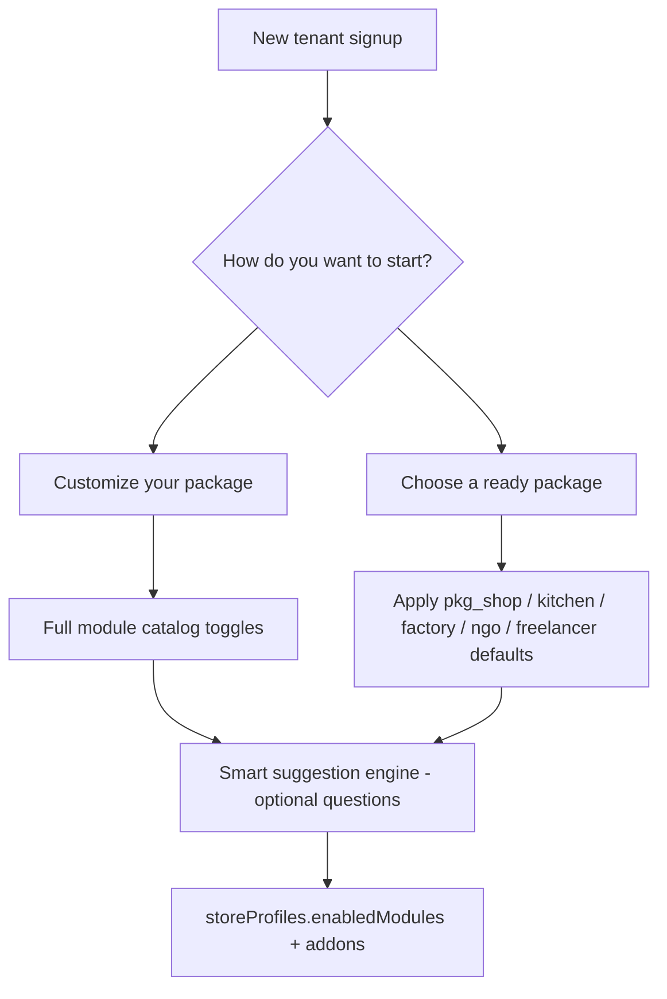
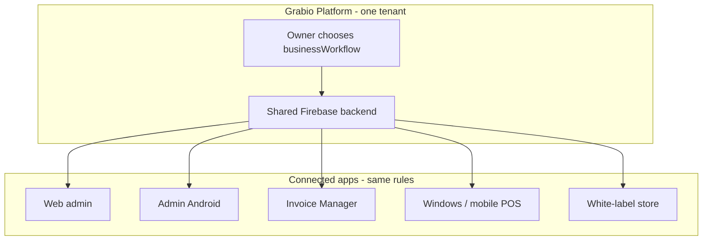
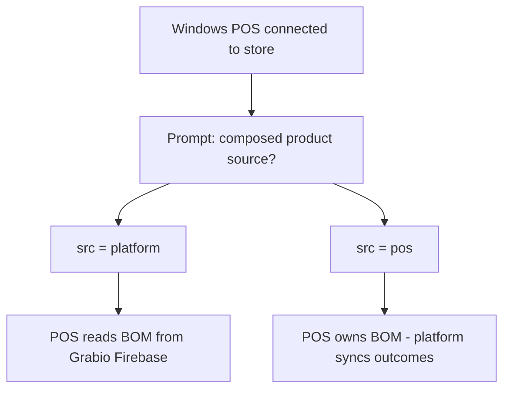
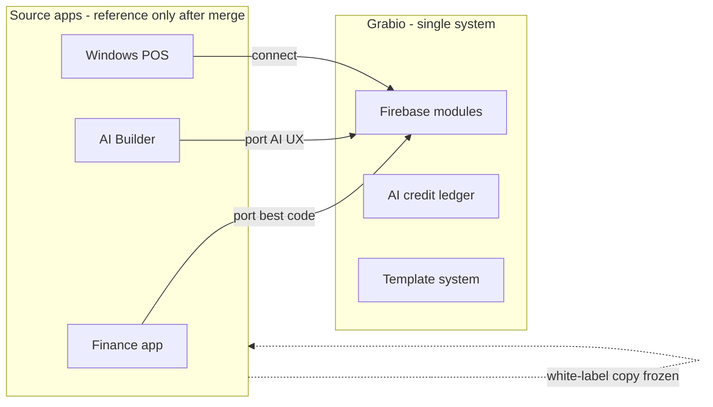
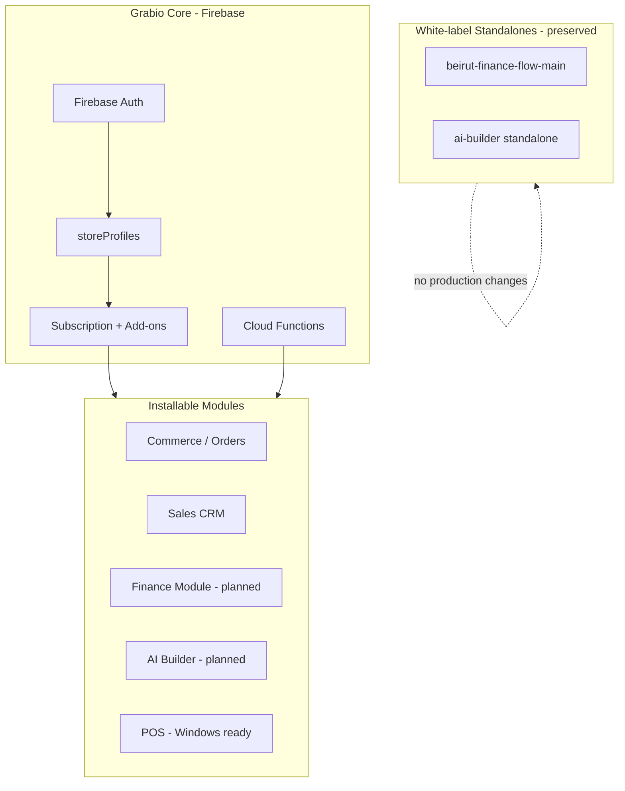

# Grabio Ecosystem Plan

**Document:** `plan-ecosys.md`  
**Location:** `the eco sys/ecosystem-plan/`  
**Status:** Planning only — no implementation without explicit owner approval  
**Last updated:** 2026-06-23 (rev. 6 — merge doctrine, AI credits, template winner)  
**Production:** Grabio is live at https://www.grabio.space — all work must be data-safe for existing clients

**Ecosystem plan folder:** `the eco sys/ecosystem-plan/`

| File | Purpose |
|------|---------|
| [`plan-ecosys.md`](plan-ecosys.md) | Master ecosystem plan (this document) |
| [`grabio-builder-prompt-packages.md`](grabio-builder-prompt-packages.md) | Package presets, onboarding suggestion engine, Portfolio PDF spec, module dependency rules |
| [`feature-inventory-study.md`](feature-inventory-study.md) | Code-based feature count + billable catalog for pricing (52 units) |
| [`feature-list.md`](feature-list.md) | Detailed feature list rev. 2 + route appendices |
| [`feature-list-final.md`](feature-list-final.md) | **Final master list for pricing** (Grabio + Finance + AI + POS) |

**Catalog source of truth (already built):**
- Public home: [`public/home.html`](../../public/home.html) — module toggles, manifest preview, three groups (Platform / Apps / AI)
- Module registry: [`src/lib/pricingDisplay.ts`](../../src/lib/pricingDisplay.ts) — `MODULE_CATALOG`, tiers, add-on pricing
- Marketing copy: [`src/lib/publicModulesContent.ts`](../../src/lib/publicModulesContent.ts) — feature bullets per module

---

## 1. Ecosystem Vision

Grabio is **no longer a single app**. It is a **unified business ecosystem**:

- **One account, one sign-in** across all Grabio modules and surfaces
- **Installable modules** (Odoo-style): Commerce, Finance, CRM, Production, POS, AI Builder, etc.
- **Tenant-level feature flags** (`storeProfiles.addons` / `enabledModules`) control which modules each store sees
- **Shared core engine:** auth, store profile, permissions, billing — not parallel siloed apps
- **White-label standalones preserved:** original copies of Finance and AI Builder remain sellable as independent products

### Main onboarding plan (locked)

Every new tenant starts with **one of two equal paths** — this is the primary product story (home page, signup, sales):

| Path | User action | What happens |
|------|-------------|--------------|
| **Customize your package** | Build from scratch | Blank module stack; user toggles any modules from the full catalog (same toggles as `/home` and `/pricing`) |
| **Choose a ready package** | Pick a preset | One of five starters (Shop, Live Kitchen, Factory Flow, NGO, Freelancer) — defaults applied, then everything stays toggleable |

**Neither path is secondary.** Custom is not an “advanced escape hatch” — it is co-primary with ready packages.

After either path: optional **smart suggestion engine** asks contextual questions and recommends modules one at a time (§2f).

### Three product layers (already on home page)

| Layer | What it is | Examples |
|-------|------------|----------|
| **Platform Features** | Web admin modules inside the account | Invoicing, marketplace, stock, factory, CRM, dropship |
| **Mobile & Desktop Apps** | Native shells — same Firebase account | Admin Android, POS, Invoice Manager, White-label store |
| **AI & Growth Tools** | In-dashboard AI — no extra app install | AI Agent, content creator, email marketing, SEO assistant |

Everything except **core platform** (invoicing, marketplace, analytics, payments, delivery) is a **modular add-on** — toggled per tenant via `storeProfiles.addons` / `enabledModules`.

### Future additions (not in workspace yet)

- **Grabio POS mobile** — Windows POS is ready; mobile POS app still to be built
- **AI Agent** — will be added under `the eco sys/` when ready
- **Hotels** and other business workflow types — planned after core workflows ship

### Architectural pillars

| Pillar | Principle |
|--------|-----------|
| **Unified core** | One tenant engine (auth, store profile, permissions, billing) |
| **Installable modules** | Commerce, Finance, CRM, Production, POS, etc. as opt-in modules with clear boundaries |
| **Feature flags** | Per-store `addons` / `enabledModules` gate routes, nav, APIs, and mobile surfaces |
| **Decoupling** | Shared types and services at core; module-specific UI and workflows stay isolated |
| **No duplication** | Single source of truth per domain (inventory, orders, customers, billing) |

---

## 2. Apps Inventory (Current State)

| App | Location | Stack | Status | Role in ecosystem |
|-----|----------|-------|--------|-------------------|
| **Grabio Web** | `src/` | React 18 + Vite + Firebase | **Production** — grabio.space | Core platform host |
| **Grabio Mobile** | `grabio-mobile/` | React Native / Expo | **Production** | Admin Android app + CRM rep mobile |
| **Firebase Functions** | `functions/src/` | Node.js | **Production** | Unified backend (api, scheduled, triggers, services) |
| **Finance (Invoice Manager)** | `the eco sys/finance/beirut-finance-flow/` | Vite + React + Supabase | **Live** — aynbeirut.dev | **Dev reference** for live-kitchen UX; ecosystem app = billing only, no compose |
| **Finance (white-label copy)** | `the eco sys/finance/beirut-finance-flow-main/` | Vite + React + Supabase | Archive / white-label | **Keep as original — do not modify** |
| **AI Builder** | `the eco sys/AI BUILDER/ai-builder/` | Next.js 14 + Prisma + PostgreSQL | Week 1 complete (standalone) | Will become Grabio AI Builder module |
| **Grabio POS (Windows)** | External — owner to confirm path | Windows desktop | **Ready** | Restaurant / retail POS — ecosystem hook-up pending |
| **White-label client app** | `white-label-client-app/` | React | Partial / beta | Per-tenant buyer storefront mobile |
| **Finance backup data** | `the eco sys/finance/backup invoice manger/` | CSV + SIM | Archive | Migration reference only |

### Client app suite — one sign-in, four apps

Each store owner can enable **one or more** native apps. All share the same Grabio account (Firebase Auth). Platform web modules are separate from app installs — apps are the mobile/desktop shells.

| App | Module ID | Status | Codebase | Who uses it |
|-----|-----------|--------|----------|-------------|
| **Grabio Admin** | `admin_mobile` | **Live** (Google Play) | `grabio-mobile/` | Store owner, managers — orders, stock, CRM rep |
| **Invoice Manager** | `invoice_manager` | Standalone live; ecosystem module planned | `the eco sys/finance/beirut-finance-flow/` | Accountants, billing-only staff — **no composed products** (see §2d) |
| **White-Label Store** | `whitelabel` | Beta / partial | `white-label-client-app/` | End customers — branded commerce |
| **Grabio POS** | `pos` | **Windows: ready** · Mobile: to build | Windows POS (external to repo — owner confirms path) | Cashiers, F&B, retail floor |

**Rule:** Admin, Invoice Manager, White-label, and POS are **optional app installs** — not every client needs all four. Web admin remains the module host; apps are focused workflows on the same data.

### Platform surfaces (target)

| Surface | Target | Notes |
|---------|--------|-------|
| **Grabio Web Admin** | Browser | Module host — `/admin/*` routes per enabled module |
| **Admin Android app** | Mobile | `grabio-mobile` — live on Google Play |
| **Invoice Manager app** | Mobile / PWA | Billing/invoicing only — consumes platform data; **does not create composed products** |
| **White-label storefront** | Per-tenant mobile | Buyer experience (`white-label-client-app`) |
| **Grabio POS Windows** | Desktop | **Ready** — restaurant / retail checkout |
| **Grabio POS Mobile** | iOS / Android | **Not built yet** — priority after Windows POS ecosystem hook-up |

---

## 2b. Business Workflow Backend (platform choice)

On the **Grabio platform** (web admin / store setup), the tenant chooses **which backend engine** drives their inventory and production data. This is a **single platform setting** — not “which app they use.” All connected apps (Admin mobile, Invoice Manager, POS) read/write against the same backend rules for that store.

Packages are **presets, not locked tiers** — see **§2f** and [`grabio-builder-prompt-packages.md`](grabio-builder-prompt-packages.md). User can start from a preset or build a fully custom module stack.

| Workflow ID | Package key | Display name | Backend behaviour | Default modules (minimum) |
|-------------|-------------|--------------|-------------------|---------------------------|
| `shop` | `pkg_shop` | Shop | Simple products, stock in/out | Inventory (simple), Invoicing, **Marketplace included** |
| `live_kitchen` | `pkg_live_kitchen` | Live Kitchen | Recipe/BOM deducted on sale — no batch production | Inventory (simple + composed), Composed Products, POS, Restaurant Production |
| `factory` | `pkg_factory_flow` | Factory Flow | BOM, production runs, raw → finished goods | Inventory (simple + composed + raw), Factory & Production |
| `ngo` | `pkg_ngo` | NGO | Billing-focused, no inventory | Invoicing, Invoice Manager **Portfolio PDF** |
| `freelancer` | `pkg_freelancer` | Freelancer | Billing-focused, no inventory | Invoicing, Invoice Manager **Portfolio PDF** |
| `hotel` | — | Hotels | Room/service workflows (future) | **Planned** |
| `custom` | — | Custom | User skips all presets | Blank module stack |

**Stored on:** `storeProfiles.businessWorkflow` / `storeProfiles.startingPackage` (proposed).

**User experience:** Owner picks one primary workflow at onboarding (or in store settings). Apps they install later **inherit** this backend — they do not pick a different workflow per app.

---

## 2c. Reference implementations (for developers — not tenant choice)

When **building or studying** ecosystem modules, use these codebases as **reference** for how each workflow behaves today. This is **not** where the end user selects their workflow — the user always chooses on the **Grabio platform** (§2b).

| Workflow | Reference codebase | What to study |
|----------|-------------------|---------------|
| Shop / simple product | Grabio web — `AdminProducts`, `AdminInventory` | Catalog, stock, orders |
| Live kitchen | Invoice Manager — `the eco sys/finance/beirut-finance-flow/` | Live recipe deduction on sale, kitchen invoicing UX |
| Factory flow | Grabio web — `AdminProduction`, `AdminRecipes`, `finishedGoodsInventory` | BOM, production runs, raw → finished |
| Restaurant checkout | Windows POS (ready, path TBD) | Register flow, F&B sale-time deduction |
| Hotels | — | Not started |

**Rule:** Reference apps stay preserved as white-label copies. Ecosystem integration **ports behaviour into the platform backend**, not “assigns the tenant to an app.”

---

## 2d. Composed products — platform only

**Locked rule:** Composed products (BOM, recipes, bundles) are **created and managed on the Grabio platform** (web admin). Satellite apps **consume** them; they do **not** define or edit composed product structure.

| Surface | Composed products |
|---------|-------------------|
| **Grabio web admin** | **Yes** — create/edit BOM, recipes, composed services (`AdminComposedProducts`, `AdminRecipes`, etc.) |
| **Admin Android app** | Read/use for orders and stock — **no compose editor** (unless explicitly scoped later) |
| **Invoice Manager mobile app** | **No** — invoicing and billing only; uses simple line items; composed products come from platform data |
| **White-label store app** | Display/sell only — no compose |
| **Windows / mobile POS** | Sell and deduct per workflow — see §2e for source-of-truth when POS is connected |

**Why:** One source of truth for product structure avoids split BOMs across apps and keeps production logic on the platform backend.

**Invoice Manager rebuild note:** When Finance becomes a Firebase module, strip or hide any composed-product **authoring** UI from the mobile app. Kitchen **deduction behaviour** still follows `businessWorkflow: live_kitchen` from the platform.

---

## 2e. Windows POS — composed product source

When a **Windows POS** (or future mobile POS) is **connected** to a Grabio store, prompt the owner during setup:

> **“What is the source of your composed products?”**

| Option | Value (proposed) | Meaning |
|--------|------------------|---------|
| **Platform** | `composedProductSource: 'platform'` | BOM/recipes live in Grabio Firebase. POS reads catalog and applies deduction rules from platform. **Default / recommended.** |
| **Windows POS** | `composedProductSource: 'pos'` | Composed product definitions are owned/maintained in the POS app. Platform syncs orders and stock outcomes — platform does not author BOM for those SKUs. |

**Stored on:** `storeProfiles.composedProductSource` (or nested under POS connection settings).

**Rules:**
- Ask **once** at POS pairing / first connect; allow change in store settings with warning (may require re-sync).
- If source = **platform**, POS must not allow creating/editing BOM — only selling and triggering platform rules.
- If source = **pos**, platform web admin should not edit those composed SKUs’ structure (read-only or synced mirror).
- Conflict detection: Cloud Function or admin UI flag if both sides try to own the same product ID.

---

## 2f. Starting packages & onboarding (from builder prompt)

Full spec: [`grabio-builder-prompt-packages.md`](grabio-builder-prompt-packages.md)

### Primary fork (see §1 — main plan)

1. **Customize your package** — start empty, pick modules from catalog  
2. **Choose a ready package** — pick one of five presets below  

Both paths end at the same module manifest system; presets only seed defaults + onboarding question set.

### Ready packages (five presets)

| Package key | Display | Default backend / modules |
|-------------|---------|---------------------------|
| `pkg_shop` | Shop | Simple inventory + marketplace included |
| `pkg_live_kitchen` | Live Kitchen | Composed + POS + restaurant production |
| `pkg_factory_flow` | Factory Flow | Raw materials + factory production |
| `pkg_ngo` | NGO | Invoicing + Portfolio PDF |
| `pkg_freelancer` | Freelancer | Invoicing + Portfolio PDF |

Detail per module list: [`grabio-builder-prompt-packages.md`](grabio-builder-prompt-packages.md) §1.

### Universal package rules

- Ready packages set **default modules at signup** and **which onboarding questions run** — they do **not** lock what the user can activate later.
- **Customize your package** skips presets entirely — same catalog, no pre-selected workflow beyond core (invoicing always on).
- **Marketplace:** included by default for **Shop only**; optional add-on for all other packages.
- Any catalog module (CRM, PSA, Web Builder, AI tools, POS, Team, Dropship, etc.) can be added on either path at any time.

### Smart suggestion engine (not static bundles)

After either path (custom or ready package), run **contextual onboarding** — ranked module suggestions with one-line reasons; user accepts **one at a time** (not “accept all”).

Question branches (examples): team size → Team + CRM; sell online → Marketplace; projects → PSA; proposals → Proposal Writer; website → Web Builder; multi-location → inventory visibility; marketing → AI suite tools.

**NGO / Freelancer growth-stage:** PSA and full Proposal Writer surfaced as **second-stage** suggestions (usage signals: multiple invoices, second client, “what else?”) — not hard-gated at signup.

### Invoice Manager — Portfolio PDF (not Web Builder)

Standalone feature inside Invoice Manager module:

- Template + images + text → **exported PDF** (portfolio/credentials for donors/clients)
- **Not** attached to invoices, not a cover page, not a live URL
- Distinct from **Web Builder** (hosted site, drag-and-drop, domain) — separate UI copy required

Composed products for inventory/production remain **platform-only** (§2d). Portfolio PDF is document export only.

### Module dependency rules (activation logic)

| Rule | Detail |
|------|--------|
| **Live Kitchen ↔ Factory Flow** | **Mutually exclusive** at inventory-deduction level — one store cannot run both (instant sale deduction vs batch production + finished goods). Multi-profile per product line = backlog, not this phase. |
| **Sales CRM + Team** | CRM does not hard-require Team, but suggestion engine should recommend Sub-Accounts when user has sales staff (reps via sub-account system). |
| **PSA + Invoicing** | No extra dependency — Invoicing is core and always on. |

### Build phase scope (from prompt)

**In scope (when approved):** Package presets, module manifest update, onboarding question schema, suggestion engine wiring.

**Out of scope this phase:** Pricing logic (separate doc); changes to live module behaviour; building Web Builder / AI Builder / PSA / Blog Publisher internals — only suggestion references.

---

## 2g. Merge doctrine — one feature, one system (locked)

**End state:** Every capability from the **three apps** becomes a **Grabio module** on Firebase. After merge completes, **no duplicate features** — one implementation, one data model, one price line per capability.

Standalone folders (`beirut-finance-flow-main`, `ai-builder`) stay as **white-label archives** only — not maintained in parallel with Grabio production.

### How to merge (not “missing forever”)

| Situation | Action |
|-----------|--------|
| Feature exists in Grabio only | Keep — extend if needed |
| Feature exists in Finance or AI Builder only | **Port** into Grabio (Firebase) — use source app as reference implementation |
| Feature exists in **both** apps | **Pick the better one** — port gaps from the other — **delete duplicate** from ecosystem |
| Feature is stub in one app, live in another | Complete using the live app’s logic |
| Feature is catalog-only on Grabio | Build by porting from best source or net-new on Firebase |

### “Pick the winner” examples (locked)

| Capability | Winner | Loser / don’t duplicate | Notes |
|------------|--------|---------------------------|-------|
| **Store / invoice templates** | **Grabio** `AdminTemplates`, `invoiceTemplates.ts` | AI Builder starter HTML templates as separate system | AI Builder module uses Grabio template store |
| **AI Builder module UX** | Port wizard + editor from **AI Builder** | Rebuild from scratch | Wire to Grabio auth + credits |
| **Live kitchen deduction** | Port behaviour from **Finance** reference + POS | Standalone Finance manufacture UI in Invoice Manager app | Backend on platform (`restaurant` workflow) |
| **Factory production** | **Grabio** `AdminProduction` | Finance generic manufacture | Already stronger on Grabio |
| **PSA / proposals** | Port from **Finance** | — | Becomes Grabio `projects` + `proposal_writer` |
| **Portfolio PDF** | Complete stub using Finance UI + Grabio PDF libs | — | Invoice Manager feature, not Web Builder |
| **SEO / marketing AI** | Extend Grabio `AdminMarketing` + `/ai/*` | — | Credit-gated agents |

### AI Builder module — templates + credits (locked)

When user opens **AI Builder** inside Grabio:

| Offering | Billing |
|----------|---------|
| **Free standard templates** | Included — sourced from Grabio template system (not a second template DB) |
| **Paid custom templates** | Add-on or one-time — owner-branded layouts in Grabio template store |
| **All AI work** (generation, edits, planner, agents) | **Prepaid credits** — deducted per operation |

**All AI agents** (`ai_agent`, `content_creator`, `proposal_writer`, `seo_assistant`, `market_strategy`, `email_marketing`, `analytics_insights`, `campaign_writer`, AI Builder chat) share the **same credit ledger** tied to `storeProfiles` + existing `/ai/models` pricing in AdminProfile.

No unlimited AI on base tier unless explicitly priced.

### Merge phases (safe for production)

| Phase | Work | Production risk |
|-------|------|-----------------|
| **M0** | Feature inventory + winner table ([`feature-inventory-study.md`](feature-inventory-study.md)) | None |
| **M1** | `enabledModules` enforcement on all modules (not only CRM) | Low — flags default off |
| **M2** | Port Finance billing features → Firebase (estimates, receipts, Portfolio PDF) | Medium — new collections, no delete of old |
| **M3** | Port PSA + AI proposals from Finance | Medium |
| **M4** | Port AI Builder → `ai_builder` module + credit billing | Medium |
| **M5** | Live kitchen backend + POS sync | Medium — workflow mutual exclusivity |
| **M6** | Deprecate duplicate UIs; standalones frozen as white-label | Low for Grabio prod |

**Rule:** Port into **new routes/collections** first; migrate client data with dry-run; never dual-write two backends for the same tenant long-term.

### Pricing implication

During merge, charge **once per capability** on the Grabio catalog. Temporary overlap (Finance standalone + Grabio web) is a **transition state**, not two products.

Detail: [`feature-inventory-study.md`](feature-inventory-study.md) §10 Port queue.

---

### 3.1 Authentication — locked decision

**Firebase is the single auth engine** for the Grabio ecosystem.

| App today | Auth | Integration path |
|-----------|------|------------------|
| Grabio Web + Mobile | Firebase Auth | Core — no change |
| Finance (beirut-finance-flow) | Supabase Auth | **Rebuild as Firebase-native Grabio module** over time |
| AI Builder | NextAuth + PostgreSQL | **Integrate as Grabio module**; Firebase auth at boundary |
| White-label standalones | Their own auth | Preserved as independent products — no forced migration |

**Rule:** Standalone Supabase/PostgreSQL apps (`beirut-finance-flow`, `beirut-finance-flow-main`, `ai-builder`) are **read-only archives** until a module rebuild is formally approved. No SSO bridge or iframe embedding — full Firebase-native rebuild for ecosystem integration.

### 3.2 Module system

Already established in production via `storeProfiles.addons` and `enabledModules`:

- Routes and nav hidden when module off (`CrmAddonGate`, `useSalesCrmAddon` pattern)
- Cloud Functions enforce add-on on activate (`functions/src/api/subscription.ts`)
- Mobile surfaces respect same flags

**Extend this pattern** to Finance (`invoice_manager`), AI Builder (`ai_builder`), POS (`pos`), Blog Publisher (`blog_publisher`).

Proposed module IDs:

| Module ID | Name | Billing model (TBD) |
|-----------|------|---------------------|
| `commerce` | Marketplace / Store | Core tier |
| `sales_crm` | Sales CRM | Add-on ($12/mo, $120/yr — shipped) |
| `dropship` | Dropship sync | Free v1 / paid add-on later |
| `invoice_manager` | Finance / Invoicing | Add-on or tier inclusion |
| `ai_builder` | AI Website Builder | Credits + tier limits |
| `pos` | Point of Sale | Add-on |
| `blog_publisher` | Blog / CMS | Add-on |
| `production` | Manufacturing / Restaurant | Tier-gated |
| `projects` | PSA / Projects | Add-on (planned) |

### 3.3 Backend

- All ecosystem APIs route through **Firebase Functions** (`functions/src/api/`)
- No new backend infrastructure until a module rebuild is approved
- Finance module rebuild: Firestore schema mirrors Supabase data model (planning phase — see §6)
- AI Builder: credit model aligned with Grabio subscription tiers (decision pending)

### 3.4 Data boundaries

---

## 4. Module Roadmap

### Priority order

| Priority | Module | Status | Notes |
|----------|--------|--------|-------|
| **1** | Sales CRM | **Built** — GPS QA pending | Physical Android device test required before client demo |
| **2** | Dropship (Shein) | Phase 1 **done** | Phase 2 (6h scheduled sync) + Phase 4 (paid scraper API) backlogged |
| **3** | Finance (Invoice Manager) | Standalone live | Rebuild as Firebase-native Grabio module; keep Supabase standalone as white-label |
| **4** | AI Builder | Week 1 complete (standalone) | Integrate as Grabio module; keep Next.js standalone as white-label |
| **5** | POS | **Windows ready** · mobile TBD | Hook Windows POS to ecosystem auth/sync; build mobile POS app |
| **6** | AI Agent | **Planned** | Add to `the eco sys/` |
| **7** | Blog Publisher | Backlog | CMS per tenant |

### Shipped modules (reference)

**Sales CRM** — full build done (web + mobile rep):
- Admin: pipeline kanban, activity feed + export, map, performance, client profile, reps + Auth invite
- Rep web portal `/team/crm`
- Mobile: `crm_rep` auth, My Clients, client detail + GPS activity log
- Gating: `salesCrm` add-on on all paid plans; `crm_rep` role + `crmReps` collection

**Dropship** — Phase 1 shipped:
- `POST /dropship/sync-product` + `sheinProductSync` service
- Admin Products: supplier row (Shein / Alibaba / Amazon + URL); sync Shein-only

### Deferred modules (study before build)

| Module | Study topics |
|--------|--------------|
| **POS mobile** | Stack for mobile shell (RN vs shared core with Admin app), offline mode, sync with Windows POS data model, hardware (receipt printer, barcode) |
| **POS ecosystem** | Windows POS already built — define repo path, auth bridge to Firebase, shared order/inventory sync without touching production Grabio |
| **Invoice Manager** | Billing-only mobile scope; **no composed-product UI**; Firestore schema; align with `invoiceTemplates` / account statement on platform |
| **Blog Publisher** | Content model (posts, categories, SEO, public routes per store) |
| **AI Builder** | Integration with `api/ai`, guardrails, credit model, white-label pages |

### Inventory & production typology (cross-module)

Driven by **§2b `businessWorkflow`** on the platform. Apps do not pick their own typology.

| Workflow | Production logic | Composed products authored where |
|----------|------------------|----------------------------------|
| **Shop** | Simple stock in/out | Platform only (N/A for simple SKUs) |
| **Live kitchen** | Recipe deduction on sale | **Platform only** — Invoice Manager does not compose |
| **Factory** | BOM, runs, raw → finished goods | **Platform only** (`AdminProduction`, etc.) |
| **POS connected** | Sale-time deduction per workflow | **§2e** — platform or POS as source |
| **Services** | Monthly/yearly billing | Platform (`services` module, beta) |
| **Hotels** | TBD | Planned |

**Cross-reference (backlog):** `productionMode: 'manufacturing' | 'restaurant'` on product or store — complements `businessWorkflow` at store level.

---

## 5. Production Safety Rules

**Hard rules — no exceptions while Grabio is in production.**

### Data & schema

- No Firestore schema migrations on production without dry-run against staging data first
- No changes to `firestore.rules` without full read + test cycle
- No bulk writes or backfill scripts against production without owner sign-off and rollback plan
- Finance app at aynbeirut.dev: **zero changes** until Finance module rebuild is formally approved

### Deploy

- Firebase Functions: **targeted deploy only** — `firebase deploy --only functions:functionName`
- Never `firebase deploy --only functions` (full blast) without explicit approval
- Never push to GitHub or deploy to production without confirmation that tests passed

### Code boundaries

- All new ecosystem integration work happens in **NEW files/routes**
- Existing production routes are not modified without explicit approval
- `white-label-client-app/` — treat as read-only unless white-label work is scoped
- `the eco sys/finance/beirut-finance-flow-main/` — **white-label original — do not modify**
- `the eco sys/finance/beirut-finance-flow/` — **live standalone — do not modify** until rebuild approved
- `the eco sys/AI BUILDER/ai-builder/` — **do not modify** until AI module rebuild approved

### Client safety

- Existing store data, orders, customers, and subscriptions must remain intact through any modular rollout
- Feature flags default **off** for new modules — opt-in only
- Pricing page toggles are **estimates only** until backend entitlements ship (checkout remains Subscription admin)

---

## 6. Immediate Next Steps

From backlog and ecosystem priorities — **planning and safe work only** until approved:

| # | Task | Type | Risk |
|---|------|------|------|
| 1 | Physical Android GPS QA for CRM | QA | None — device test only |
| 2 | Update owner + sales guides (`public/store-owner-guide.html`, `public/sg.html`) | Docs | None |
| 3 | Pricing backend single source of truth (`PRICING` / `PLAN_LIMITS` / module registry shared across Pricing, Subscription, Functions) | Code — needs approval | Medium |
| 4 | Finance module: define Firestore schema to mirror Supabase data model | Planning only | None |
| 5 | AI Builder: decide credit model integration with Grabio subscription tiers | Decision | None |
| 6 | Module manifest schema (id, version, required core version, permissions, routes) | Planning | None |
| 7 | Centralize feature-flag resolution (web + mobile + functions) | Code — needs approval | Medium |
| 8 | Hint system Phase 0 — registry + 2–3 pilot screens | Code — needs approval | Low |
| 9 | Owner shares **price plan** document → align `MODULE_CATALOG` + billing entitlements | Planning | None |
| 10 | Document Windows POS repo path + integration contract (auth, orders, stock sync) | Planning | None |
| 11 | Define `storeProfiles.businessWorkflow` + `composedProductSource` fields | Planning only | None |
| 12 | Invoice Manager module spec: explicit exclusion of composed-product authoring UI | Planning only | None |
| 13 | Windows POS pairing flow: composed-product source prompt (§2e) | Planning only | None |

### CRM sign-off blocker

Physical device test checklist (Android — not emulator):

1. Install dev build on physical phone (`expo run:android` or release APK)
2. Sign in as CRM rep created via **Reps** (server flow)
3. Open a client → **Log activity** → allow location when prompted
4. Confirm coordinates appear; save log; verify in admin **Activities** and **Map**
5. Deny permission once → confirm alert + **Open Settings** path works

---

## 7. Decisions Log

| Date | Decision | Status |
|------|----------|--------|
| 2026-06-23 | Grabio = ecosystem, not single app | **Locked** |
| 2026-06-23 | Plan file lives at `the eco sys/ecosystem-plan/plan-ecosys.md` | **Locked** |
| 2026-06-23 | Finance integration: rebuild as Firebase-native Grabio module | **Locked** |
| 2026-06-23 | Auth: Firebase as single auth engine across ecosystem | **Locked** |
| 2026-06-23 | White-label copies preserved (`beirut-finance-flow-main`, standalone AI Builder) | **Locked** |
| 2026-06-23 | POS + AI Agent: add to `the eco sys/` when ready | **Locked** |
| 2026-06-23 | Module gating: `storeProfiles.addons` / `enabledModules` | **Locked** (pattern exists) |
| 2026-06-23 | Client gets up to 4 apps (Admin, Invoice Manager, White-label, POS) — modular, same sign-in | **Locked** |
| 2026-06-23 | Windows POS **ready**; mobile POS **to build** | **Locked** |
| 2026-06-23 | Business workflow = **platform backend choice** (shop / live kitchen / factory) — not per-app | **Locked** |
| 2026-06-23 | Reference codebases (Finance, Grabio web, Windows POS) = **dev study only** — not tenant routing | **Locked** |
| 2026-06-23 | **Composed products: platform only** — Invoice Manager app must not include compose | **Locked** |
| 2026-06-23 | Windows POS connect: ask **composed product source** (platform vs POS) | **Locked** |
| 2026-06-23 | **Main plan:** Customize your package OR choose a ready package — equal primary paths | **Locked** |
| 2026-06-23 | Five starting packages: Shop, Live Kitchen, Factory Flow, NGO, Freelancer (`pkg_*` keys) | **Locked** — see `grabio-builder-prompt-packages.md` |
| 2026-06-23 | Live Kitchen and Factory Flow **mutually exclusive** per tenant | **Locked** |
| 2026-06-23 | Marketplace included for Shop only; optional for other packages | **Locked** |
| 2026-06-23 | Portfolio PDF in Invoice Manager ≠ Web Builder | **Locked** |
| 2026-06-23 | Package presets + suggestion engine spec pasted in ecosystem-plan folder | **Locked** |
| 2026-06-23 | **Merge doctrine:** all 3 apps → Grabio modules; no duplicate features after merge | **Locked** |
| 2026-06-23 | Duplicate features: **pick best implementation** — e.g. Grabio templates win over AI Builder templates | **Locked** |
| 2026-06-23 | AI Builder in Grabio: free standard templates + paid custom templates; **all AI on credits** | **Locked** |
| 2026-06-23 | **All AI agents** use shared prepaid credit ledger | **Locked** |
| 2026-06-23 | Gaps in Grabio code = **port from Finance / AI Builder** — not separate forever | **Locked** |
| Prior | CRM add-on on all paid plans; `crm_rep` role; pipeline `closed` = conversion metric | **Locked** |
| Prior | Dropship Phase 1: manual sync, Shein-only auto-sync | **Locked** |
| TBD | Dollar pricing per package vs per module | Open — **package doc says pricing is separate** |
| TBD | AI Builder credit model vs Grabio tiers | Open |
| TBD | POS mobile stack (RN shared with Admin vs separate app) | Open |
| TBD | Windows POS codebase location in workspace / deploy path | Open — owner to confirm |
| TBD | Hotel workflow scope and module boundaries | Open |

---

## 8. Related Documents

| Document | Location | Purpose |
|----------|----------|---------|
| Backlog | `backlog.md` | CRM, dropship, modular paradigm, pricing alignment, hints |
| App planning | `docs/planning/app.md` | Grabio app-level planning |
| Finance README | `the eco sys/finance/beirut-finance-flow/README.md` | Standalone finance deployment |
| AI Builder README | `the eco sys/AI BUILDER/README.md` | AI Builder platform overview |
| Root README | `README.md` | Grabio web app dev + deploy |
| Public home | `public/home.html` | Live module catalog UI + manifest preview |
| Pricing display | `src/lib/pricingDisplay.ts` | `MODULE_CATALOG`, `PLAN_PRICING`, `ADDON_PRICING` |
| Public modules | `src/lib/publicModulesContent.ts` | Feature bullets for marketing pages |
| Package & onboarding spec | `the eco sys/ecosystem-plan/grabio-builder-prompt-packages.md` | 5 packages, suggestion engine, Portfolio PDF, dependencies |

---

## 9. Pricing & Entitlements

**Package architecture** (presets, defaults, onboarding) is defined in [`grabio-builder-prompt-packages.md`](grabio-builder-prompt-packages.md). **Dollar pricing** for packages/modules is explicitly **out of scope** for that build phase — to be defined separately.

**Current billing (production today):**

| Tier | Monthly | Yearly |
|------|---------|--------|
| Starter | $10 | $100 |
| Pro | $20 | $200 |
| Business | $30 | $300 |

**Shipped add-ons (backend charges today):** `domainPackage`, `whatsappBusiness`, `salesCrm`, `extraStorage`

**Home page + `/pricing` toggles** show the full modular catalog (30+ modules) but **checkout still uses Subscription admin** — toggles are estimates until entitlements ship.

**Next:** When dollar pricing doc arrives, align:
1. `MODULE_CATALOG` billing fields (`core` / `tier` / `addon` / `planned`)
2. `functions/src/api/subscription.ts` line items
3. `storeProfiles.addons` + `startingPackage` enforcement
4. Per-app pricing (Admin included, POS, Invoice Manager, White-label as separate SKUs if needed)
5. Package preset → default module manifest at signup

---

## 10. Implementation Gate

**No code changes to production Grabio, Finance standalone, or AI Builder standalone until:**

1. Owner reviews this document
2. Specific module or task is explicitly approved ("confirm" or scoped instruction)
3. Production safety rules in §5 are acknowledged for that task

**Next owner action:**
1. Share **dollar pricing** document (package doc covers structure only)
2. Confirm **Windows POS** repo/path
3. Reply **confirm** on `grabio-builder-prompt-packages.md` to start Phase 0 (presets + manifest + onboarding schema) — or ask clarifications first
4. Approve first implementation slice per §5 production safety rules

**Questions for owner:**
- Where does the Windows POS codebase live (folder name / repo)?
- Should mobile POS be a separate Play Store app or a mode inside Admin app?
- When `composedProductSource = pos`, what is the sync contract (which fields platform mirrors)?

---

*Grabio Ecosystem Plan — planning document only. Production clients and data remain protected.*
